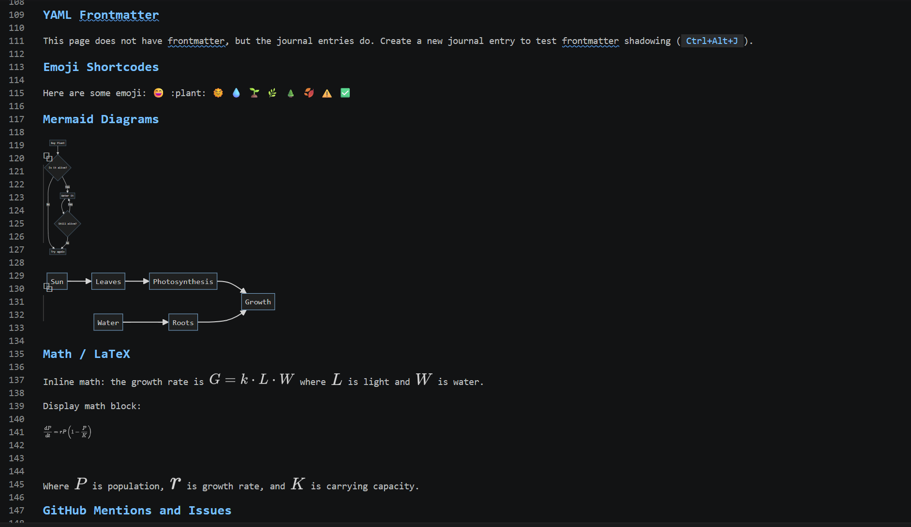
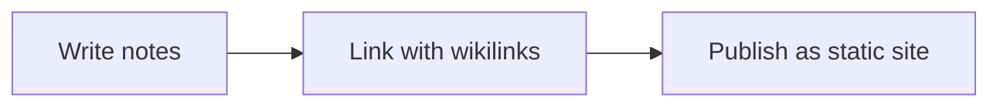

# AS Notes - Inline Markdown Editing in VS Code

**Bold text looks bold. Headings look like headings. Mermaid diagrams render as diagrams. All in the same editor tab where you write the Markdown.**

Preview panes split your attention. You write on the left, read on the right, and spend more time keeping the pane visible than actually thinking. Switcher-based editors like Typora solve this by rendering in place - AS Notes has adopted this behaviour for your in-editor personal knowledge base.

The AS Notes inline editor brings a Typora like rendering model into VS Code (based on [github.com/SeardnaSchmid/markdown-inline-editor-vscode](https://github.com/SeardnaSchmid/markdown-inline-editor-vscode)), along with Mermaid diagramming and LaTeX math support.

> Download from [AS Notes - VS Code Marketplace](https://marketplace.visualstudio.com/items?itemName=appsoftwareltd.as-notes)



## How it works

The inline editor uses a three-state visibility model for every construct it renders:

| State | When | What you see |
|---|---|---|
| **Rendered** | Cursor is on another line | Clean formatted output, syntax hidden |
| **Ghost** | Cursor is on the same line | Syntax characters at reduced opacity |
| **Raw** | Cursor is inside the construct | Full Markdown source |

The cursor is always the truth. Move away from a line and `**bold**` becomes **bold**. Move back to the line and the `**` reappears, faint, so you know it's there. Click directly into the word and you see the full raw syntax.

This means you never lose access to the source. You just don't see it when you don't need it.

## What renders

**Text formatting.** Bold (`**text**`), italic (`*text*`), bold italic (`***text***`), and strikethrough (`~~text~~`) all render inline. Inline code (`` `code` ``) renders with code styling.

**Headings.** `# H1` through `###### H6` render at progressively larger font sizes. The `#` markers disappear when the cursor is elsewhere and return at full opacity (not faint) when the cursor is on the heading line.

**Links and images.** `[link text](url)` hides the URL and the brackets, showing only the link text in the standard link colour. Ctrl+Click to follow the link. `` shows the alt text inline; hover for an image preview.

**Tables.** GFM pipe tables render as a visual grid. Move the cursor inside the table and the raw pipe syntax comes back.

**Code blocks.** Fenced code blocks show the language label at reduced opacity when rendered. Move inside the block and the full source is exposed.

**YAML frontmatter.** The `---` delimiters and frontmatter content render at reduced opacity when the cursor is elsewhere. Move inside and you see the full YAML.

**Mermaid diagrams.** A code block tagged `` ```mermaid `` renders as an inline SVG diagram. The diagram appears in the editor at the cursor position when you move away from the block. Hover over the code block for a preview at any time.

**LaTeX / math.** Inline math (`$...$`) and display math (`$$...$$`) render using KaTeX. Toggle via `as-notes.inlineEditor.defaultBehaviors.math`.

**Emoji shortcodes.** `:smile:` becomes 😄, `:seedling:` becomes 🌱. The shortcode reappears in ghost/raw state.

**Task list checkboxes.** `- [ ] item` renders with a styled checkbox. Click it to toggle the task - no keyboard shortcut needed.

**Blockquotes and horizontal rules.** `> text` styles the `>` marker and indents the text. `---` on its own line renders as a visual separator.

## Mermaid diagrams in the editor

The Mermaid integration is worth calling out specifically. A note with a sequence diagram or flowchart in it has always required a separate preview to see the diagram. With the inline editor, the rendered SVG appears in the editor itself.

Write mermaid syntax as normal:

````

````

When you move the cursor off the block and the diagram replaces the code. Move back and the source returns. The diagram is always one cursor movement away.

## Outliner mode

When AS Notes outliner mode is active, the inline editor works alongside it. Bullet markers and checkbox syntax are styled inline rather than hidden - bullets render as styled bullets, checkboxes render with a bullet and checkbox graphic - while the three-state visibility still applies to inline formatting inside the bullet content.

## Toggling

The inline editor is on by default for Markdown files inside your AS Notes workspace. Toggle it using any of:

- **Command Palette:** Run **AS Notes: Toggle Inline Editor**
- **Editor title bar:** Click the eye icon beside the file name
- **Setting:** Set `as-notes.inlineEditor.enabled` to `false`

The toggle state persists per workspace.

## Key settings

| Setting | Default | Description |
|---|---|---|
| `as-notes.inlineEditor.enabled` | `true` | Master toggle |
| `as-notes.inlineEditor.decorations.ghostFaintOpacity` | `0.3` | Opacity for ghost-state syntax |
| `as-notes.inlineEditor.links.singleClickOpen` | `false` | Open links with single click |
| `as-notes.inlineEditor.defaultBehaviors.emoji` | `true` | Render emoji shortcodes |
| `as-notes.inlineEditor.defaultBehaviors.math` | `true` | Render math expressions |

Heading colours per level and other fine-grained controls are in the `as-notes.inlineEditor.colors.*` namespace. See the [full settings reference](https://docs.asnotes.io/settings.html).

## Things to know

**It only activates inside your AS Notes workspace root.** Files outside the root (e.g. a README at the workspace root when `rootDirectory` points to a subfolder) are not decorated.

**Conflict with other inline editors.** If you have the standalone [Markdown Inline Editor](https://github.com/SeardnaSchmid/markdown-inline-editor-vscode) extension installed, AS Notes detects it and shows a warning. Running both produces duplicate decorations and broken checkbox toggles. The notification lets you disable either one.

**Performance.** The inline editor uses a parse cache and incremental updates per document. On very large files (1000+ lines with heavy formatting) you can toggle it off for that session if you notice lag.

## Getting started

Install from the [VS Code Marketplace](https://marketplace.visualstudio.com/items?itemName=appsoftwareltd.as-notes). If you already have AS Notes, the inline editor is active in the current release with no configuration required.

Open any Markdown file in your workspace and move the cursor off a line with bold text or a heading. The formatting renders immediately.

AS Notes is free. Pro features (templates, table commands, kanban, encrypted notes) are available at [asnotes.io/pricing](https://www.asnotes.io/pricing).

## Resources

- [VS Code Marketplace](https://marketplace.visualstudio.com/items?itemName=appsoftwareltd.as-notes)
- [Documentation](https://docs.asnotes.io)
- [Inline Editor docs](https://docs.asnotes.io/inline-editor.html)
- [Demo notes](https://github.com/appsoftwareltd/as-notes-demo-notes)
- [Pricing](https://www.asnotes.io/pricing)
