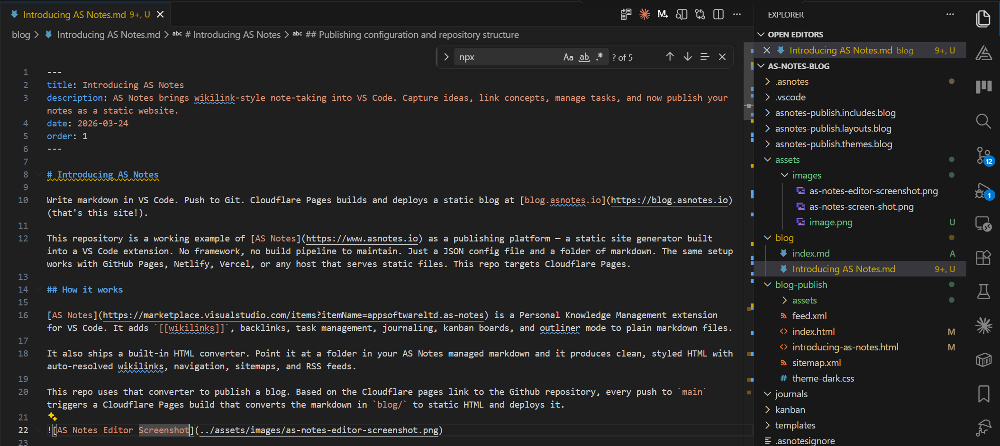
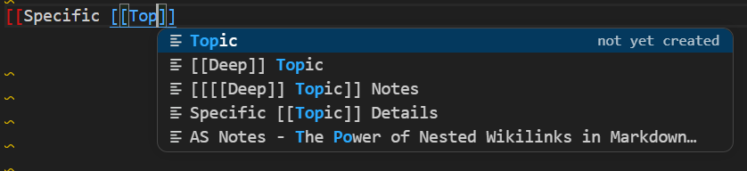

# AS Notes - Notes, Docs, Wiki and Blog for Cursor, Windsurf and Antigravity

**Your AI-first editor is already where you write code and talk to your AI agent. Your notes, docs, wiki, and blog should live there too.**

Cursor, Windsurf, and Google's Antigravity editor are VS Code-compatible. That means every extension built for VS Code works in all three. AS Notes is one of them.

> **Download:** [VS Code Marketplace](https://marketplace.visualstudio.com/items?itemName=appsoftwareltd.as-notes) · [Open VSX](https://open-vsx.org/extension/appsoftwareltd/as-notes) · [GitHub](https://github.com/appsoftwareltd/as-notes) · [Demo Notes](https://github.com/appsoftwareltd/as-notes-demo-notes)

Open VSX is the extension registry used by Cursor, Windsurf, Antigravity, and other VS Code-compatible editors that don't pull from the Microsoft marketplace. AS Notes is listed on both.

## One editor. Everything in it.

Most developers already maintain four separate tools for their writing: a note-taking app, a documentation platform, a wiki, and a blog. Different accounts, different formats, different logins. None of them talk to your editor.

AS Notes puts all four into the editor you're already in.

**Notes.** Write standard markdown files, link them with `[[wikilinks]]`, and navigate your knowledge base without ever opening a browser tab. Backlinks, task tracking, daily journals, and kanban boards — all backed by plain `.md` files.

**Documentation.** Use the same wikilink-connected notes as your project's technical documentation. The same Git repository. The same review process. No separate Confluence space to keep in sync with the code.

**Wiki.** A shared workspace in Cursor or Windsurf becomes a team wiki. Wikilinks resolve globally. Every page links to every other. The backlinks panel shows you what connects to what.

**Blog.** AS Notes ships a built-in static site generator. Point it at a folder of markdown, push to Git, and your blog deploys to Cloudflare Pages, GitHub Pages, Netlify, or Vercel. This blog is published exactly that way.

## Why AI-first editors make the best home for your notes

Cursor, Windsurf, and Antigravity are built around the idea that your AI agent should have access to everything you're working on. That cuts both ways.

When your notes are in the same workspace as your code, your AI agent can actually use them. Ask your agent to draft documentation from your notes. Ask it to find the decision record for a past architecture choice. Ask it to turn your rough kanban breakdown into a structured spec. None of that works if your notes are in a different app.

AS Notes makes your knowledge base a first-class citizen in the same workspace your agent is already operating in.

## What AS Notes gives you

**Wikilinks that work like they should.** Type `[[Page Name]]` anywhere in your notes and it resolves globally — no folder paths, no file extensions. Rename a file and every reference to it updates automatically. Case-insensitive matching, page aliases, nested links, and subfolder resolution are all handled.

**Backlinks with full context.** The backlinks panel shows every page that links to the current one, with the full chain of surrounding context. Navigate to any source line with a single click.

**Task management in your notes.** Toggle TODOs with `Ctrl+Shift+Enter`. Add priority (`#P1`, `#P2`, `#P3`), due dates (`#D-2026-03-27`), and waiting flags (`#W`) as inline hashtags. The Tasks panel aggregates everything across your entire workspace.

**Daily journal.** `Ctrl+Alt+J` creates today's journal from a template. A calendar panel in the sidebar shows which days have entries.

**Kanban backed by markdown.** Each card is a `.md` file with YAML front matter. Drag between lanes, attach files — every change is a plain text file you can diff and commit.

**Outliner mode.** Toggle it on and every line becomes a bullet. Tab/Shift+Tab to indent, Enter to continue.

**Inline markdown rendering.** Bold looks bold. Headings look like headings. Mermaid diagrams render as diagrams — all in the same editor tab where you write. No preview pane, no mode switch.

**Nested wikilinks.** `[[[[AS Notes]] Changelog]]` creates two independently navigable links — one to `AS Notes.md` and one to `[[AS Notes]] Changelog.md` — from a single expression. Both receive backlinks. Your hierarchy is expressed in the link, not in a folder structure.

## Publishing: from notes to deployed website

AS Notes includes a built-in converter that turns your markdown into a deployable static site — blog, documentation site, or wiki. The same converter that builds [blog.asnotes.io](https://blog.asnotes.io) and [docs.asnotes.io](https://docs.asnotes.io).

The full workflow:

1. Write markdown notes in Cursor, Windsurf, or Antigravity with AS Notes
2. Add a JSON config file pointing at your input folder
3. Run the converter locally or via `npx @appsoftwareltd/asnotes-publish`
4. Push to Git — Cloudflare Pages, GitHub Pages, Netlify, or Vercel picks it up

Wikilinks resolve to HTML links automatically in the output. Navigation, sitemaps, RSS feeds, and theming are all handled. No separate build framework. No static site generator to learn or maintain.

For the full setup: [Publishing a Static Site docs](https://docs.asnotes.io/publishing-a-static-site.html).

## Everything runs offline

AS Notes does not phone home. No telemetry, no cloud sync, no data leaving your machine.

All indexing runs on a local SQLite database (`.asnotes/index.db`) using `sql.js` — a WASM build of SQLite with zero native dependencies. It works on an air-gapped machine. The source is [on GitHub](https://github.com/appsoftwareltd/as-notes) and auditable.

This matters in Cursor and Windsurf especially, where your notes might sit alongside confidential source code. AS Notes doesn't touch what it doesn't need to.

For sensitive notes, AS Notes Pro supports AES-256-GCM encryption stored in the OS keychain via VS Code's `SecretStorage` API — never written to disk.

## Getting started in Cursor, Windsurf, or Antigravity

Because all three editors use the Open VSX extension registry (or the VS Code Marketplace directly), installation is the same as any other extension:

1. Open the Extensions panel (`Ctrl+Shift+X`)
2. Search for **AS Notes**
3. Click **Install**
4. Open the Command Palette (`Ctrl+Shift+P`) and run **AS Notes: Initialise Workspace**

That's it. Type `[[` in any markdown file and you're linking.

For a ready-made workspace to explore, clone the [demo notes repository](https://github.com/appsoftwareltd/as-notes-demo-notes) and open it in your editor.

## Free and Pro

The core feature set — wikilinks, backlinks, task management, journaling, outliner mode, inline markdown rendering, and publishing — is free.

Pro adds templates, table slash commands, kanban boards, and AES-256-GCM encrypted notes. Licence keys at [asnotes.io/pricing](https://www.asnotes.io/pricing).

## Resources

- [VS Code Marketplace](https://marketplace.visualstudio.com/items?itemName=appsoftwareltd.as-notes)
- [Open VSX](https://open-vsx.org/extension/appsoftwareltd/as-notes) — for Cursor, Windsurf, Antigravity, and other VS Code-compatible editors
- [GitHub](https://github.com/appsoftwareltd/as-notes)
- [Documentation](https://docs.asnotes.io)
- [Demo notes repository](https://github.com/appsoftwareltd/as-notes-demo-notes)
- [Pricing](https://www.asnotes.io/pricing)
- [Discord](https://discord.gg/QmwY57ts)
