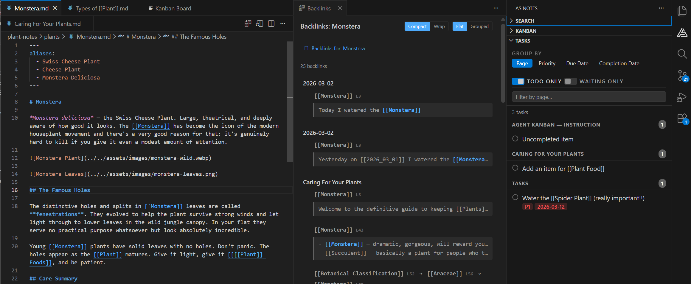

# Introducing AS Notes

- [VS Code Marketplace](https://marketplace.visualstudio.com/items?itemName=appsoftwareltd.as-notes)
- [GitHub](https://github.com/appsoftwareltd/as-notes)
- [Docs](https://www.asnotes.io)

Thank you for finding your way to our new blog. We'd like to introduce you to **AS Notes**:

Most note-taking tools want you to leave your editor. AS Notes doesn't. It brings `[[wikilink]]` style knowledge management directly into VS Code, where many of us already spend most of our day.

No Electron wrapper. No separate app to context-switch into. Just your editor, your markdown files, and a lightweight SQLite index that ties everything together.



## What you get

AS Notes is a Personal Knowledge Management System that runs as a VS Code extension. At its core: you write markdown files, link them with `[[wikilinks]]`, and the extension handles resolution, backlinks, renaming, and navigation across your entire workspace.

But it goes further than that.

**Wikilinks that actually work.** Links resolve globally across your workspace. Nested links like `[[Specific [[Topic]] Details]]` create multiple navigable targets. Rename a link and every reference updates. Case-insensitive matching, page aliases, subfolder resolution - it handles the edge cases so you don't have to.

**Task management built into your notes.** Toggle TODOs with `Ctrl+Shift+Enter`. Add priority (`#P1`, `#P2`, `#P3`), due dates (`#D-2026-03-20`), and waiting flags (`#W`) as inline hashtags. The Tasks panel aggregates everything across your workspace with grouping by page, priority, due date, or completion date.

**Kanban boards backed by markdown.** Each card is a `.md` file with YAML front matter. Drag cards between lanes, add entries, attach files. Every change is a diffable text file you can version control.

**Daily journaling.** `Ctrl+Alt+J` creates today's journal from a template. A calendar panel in the sidebar shows which days have entries. Click any day to open it.

**Backlinks with full context.** The backlinks panel shows every incoming link as a chain - the full outline path from root to link. Group by page or by chain pattern. Click any link to jump straight to the source line.

**Outliner mode.** Toggle it on and every line starts with a bullet. Tab/Shift+Tab for indentation, Enter continues the list, and multi-line paste splits into individual bullets.

**Slash commands.** Type `/` for quick access to date insertion, code blocks, tables (with add/remove column and row operations), templates, and task metadata.

All of this runs on plain markdown files. No proprietary format. No lock-in. Git-friendly from day one.

## Publishing your notes as a static site

This is the feature we've most recently shipped. AS Notes now includes a built-in tool that converts your markdown notes into a static website.

The documentation you're reading right now was written in AS Notes and published using the same tool.

### How it works

Point the converter at a folder of markdown files and it produces clean HTML. Wikilinks between pages resolve to the correct `.html` links automatically. A navigation sidebar is generated from your public pages. Output filenames are slugified to clean URLs (`Getting Started.md` becomes `getting-started.html`).

You control what gets published with YAML front matter:

```yaml
---
public: true
title: My Page
description: A short description for SEO
layout: docs
date: 2026-03-24
---
```

Pages without `public: true` are skipped. Or pass `--default-public` to publish everything unless a page opts out. Encrypted `.enc.md` files are always excluded - a hardcoded safety net.

### Layouts and themes

Three built-in layouts ship out of the box:

- **docs** - sidebar navigation with content area (what you're looking at)
- **blog** - sidebar with a narrower, article-style content area and date display
- **minimal** - content only, no navigation

Two themes are included (`default` and `dark`), both producing clean, editable CSS. You can override per-page with front matter, bring your own stylesheets, or create entirely custom layouts with template tokens like `{{content}}`, `{{nav}}`, and `{{toc}}`.

### Asset pipeline, SEO, and feeds

Referenced images are automatically discovered and copied to the output. Retina support is built in - per-image with `{.retina}`, per-page via front matter, or globally with `--retina`.

Every site gets a `sitemap.xml` and an RSS `feed.xml` generated automatically. Add `description:` front matter for `<meta>` SEO tags. Set `--base-url` for subdirectory deployments.

### Run it anywhere

Install as an npm package for CI/CD:

```bash
npx asnotes-publish --config ./asnotes-publish.json
```

Or run it directly from VS Code with the **AS Notes: Publish to HTML** command.

The config file keeps things reproducible:

```json
{
    "inputDir": "./pages",
    "outputDir": "../docs",
    "defaultPublic": true,
    "layout": "docs",
    "theme": "default",
    "baseUrl": ""
}
```

Deploy to GitHub Pages, Netlify, Vercel, Cloudflare Pages - anywhere that serves static files.

### Custom navigation

Don't want auto-generated navigation? Create a `nav.md` at the root of your input directory. Write it in markdown with wikilinks and it becomes the sidebar for every page:

```markdown
## Guides

- [[Getting Started]]
- [[Publishing a Static Site]]

---

## Reference

- [[Settings]]
- [[Wikilinks]]
```

## Privacy first

AS Notes does not send your data anywhere. The index is a local SQLite database. Your encryption keys are stored in the OS keychain. Your notes stay on your machine (or wherever you choose to sync them).

## Getting started

Install from the [VS Code Marketplace](https://marketplace.visualstudio.com/items?itemName=appsoftwareltd.as-notes). Open the Command Palette and run **AS Notes: Initialise Workspace**. That's it.

For a sample knowledge base to explore, clone the [demo repository](https://github.com/appsoftwareltd/as-notes-demo-notes).

For publishing, the [documentation](https://docs.asnotes.io) covers the full setup - front matter fields, layouts, themes, asset pipeline, CI/CD configuration, and multi-site publishing.

AS Notes is free. Pro features (templates, table commands, kanban, encrypted notes) are available with a licence key from [asnotes.io](https://www.asnotes.io/pricing).
